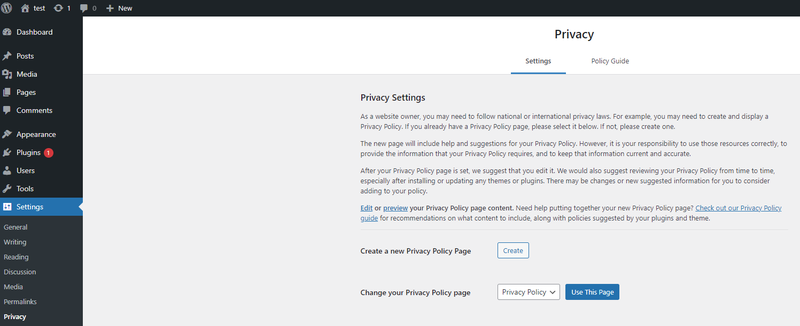
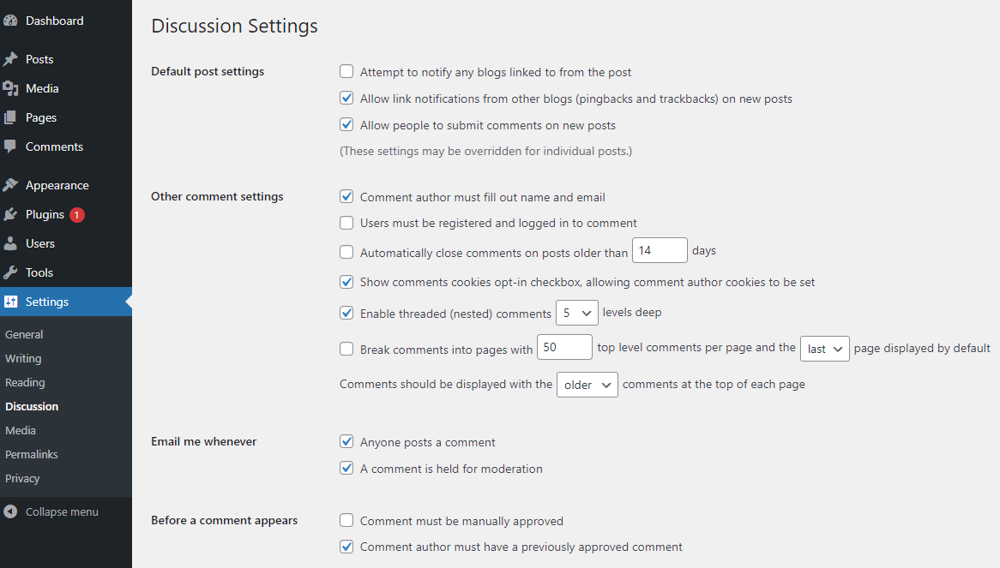
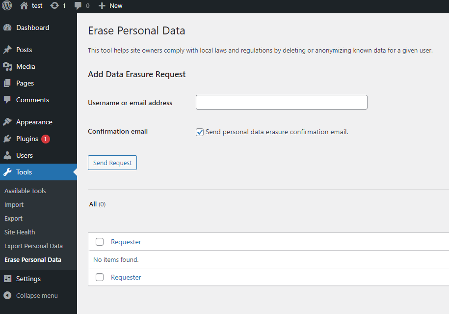
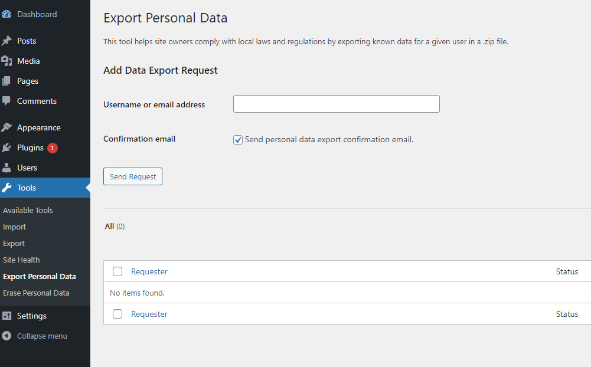
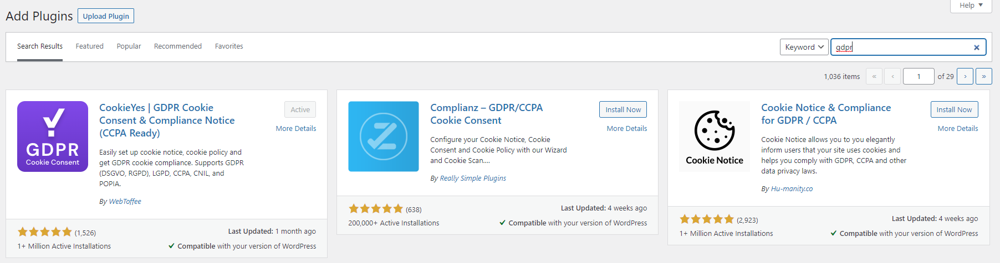
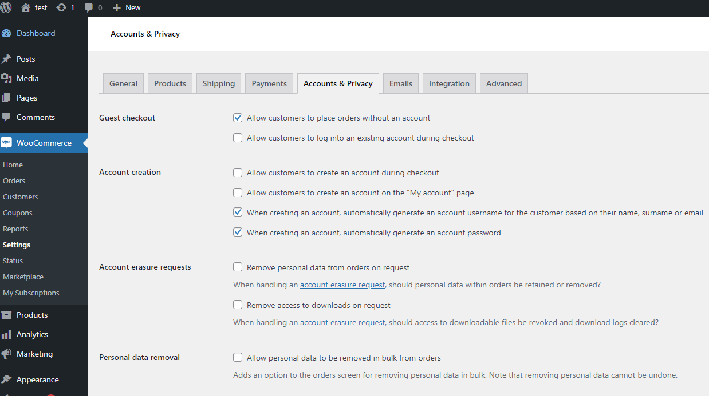

# What is GDPR?
GDPR is a data privacy and security law subject to all organizations that target or collect data related to people in the EU.
# Data Subjects (DS)
Data subjects are all human beings of which you collect information from during business operations.

# Rights
 - Right to be informed
    Privacy policy generator is availa under settings then privacy.
    
 - Right of access
    In Discussion setting, comments cookies are allowed to be disabled.
    
 - Right to retification
 - Right to erasure
    Personal data can be erased upon request.
    
 - Right to restrict processing
 - Right to data portability
     Under Tools, Export Personal Data, personal information can be exported
    
 - Right to object
 - Right srelated to automated decision making and profiling

# Woo Commerce Cookies Related configurations
1. Install the GDPR Cookie Concent plugin
    
2. Enable cookie bar and select GDPR
    
3. Personal data can be erased upon request.
    